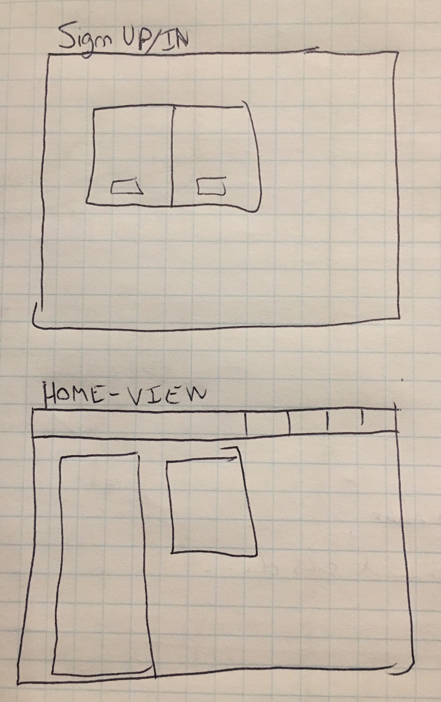
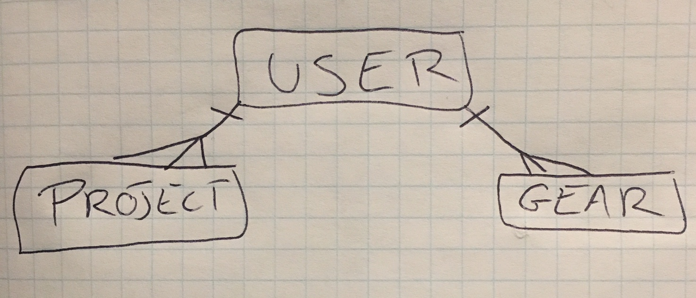
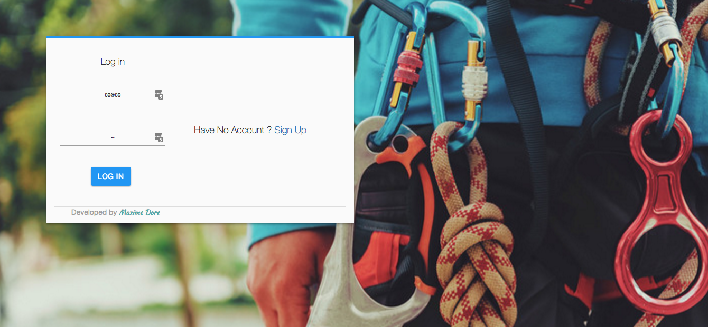
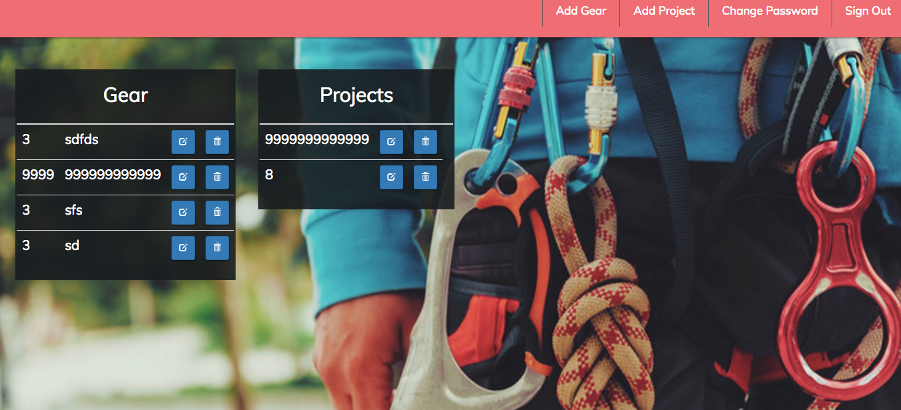

## About

This is a frontend repo for a Single Page Application that lets user keep a record of all their gear and projects.

I took two approaches for this project. This is because I had to balance all the tools at my disposal and the fact that I only had less than a week to meet all the requirements.

I first deployed my app without a framework and used JQuery and AJAX instead. Since I had done this before I knew it would be quick with no major hurdles and it seemed promising within 2 days.

With 4 days left, I took on the challenge of implementing Ember as the frontend framework. After making no progress after 2 days, I decided to go back to the other version (this one) and improve it: adding a second resource to the backend, great visuals, slick functionality, and overcoming hurdles.

One of the tougher challenges, was users being able to see a previous user's resources for a second before the handlebars injected the current user's resources. I overcame this after many different approaches. However, the last, which was the most simple, was successful. I created an empty handlebar which would be inserted (and replace the past handlebar) when a user signed out. Therefore, old data is not 'hidden' behind other divs, but is removed totaly from the browser.

## Dependencies

npm install

## User Stories

Users are intended to be rock climbers. As a climber myself I know how annoying it is to always count how much of this or that gear you have, so this appear will get rid of this nuance.

As a user I want to:
- Sign up
- Sign in
- Change password
- Sign out
- view all my gear
- Add gear
- Update my gear
- Delete my gear
- view all my projects
- Add projects
- Update my projects
- Delete my projects

## Visuals

##### Proposed Architecture

I wanted a user to own his/her gear and projects, but not have gear and projects have a relationship.
In the future, I may link the two in order to have users specific gear for specific projects.

## Technologies used

I use a Mac Air '10 which was a nuance as it has become quite slow and each task took a few more seconds which all in all added hours. everything was tested using Chrome and was developed with Atom.
Everything in the front-end is developed with Javascript, AJAX, JQuery, handlebars, SCSS, Bootstrap, and HTML.

## Links & URLs

- Back-end repo: https://github.com/doremaxime/gear-backend
- Heroku: https://capstone-project-gear.herokuapp.com/
- Website: https://doremaxime.github.io/gear-frontend/
